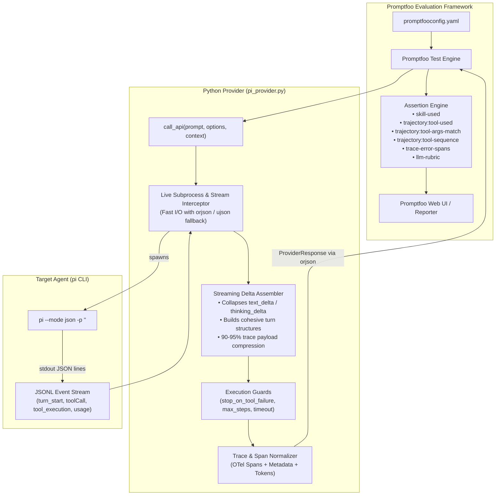
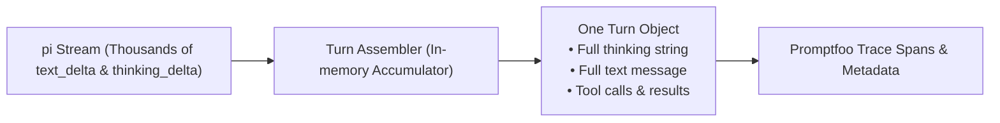

# Architecture & Design: Promptfoo Evaluation Harness for `pi` Agent

This document details the internal architecture, event streaming pipeline, trace normalization, and performance optimizations of the `pi` agent evaluation harness.

---

## 1. High-Level Architecture



---

## 2. Component Design & Contracts

### 2.1 Promptfoo Python Provider Interface

Promptfoo loads `file://pi_provider.py` and calls `call_api(prompt, options, context)`:

```python
def call_api(prompt: str, options: dict, context: dict) -> dict:
    """
    Args:
        prompt: Rendered test prompt.
        options: Provider configuration from promptfooconfig.yaml.
        context: Test variables (context['vars']), metadata, and test properties.

    Returns:
        ProviderResponse dictionary:
        {
            "output": str,             # Final assistant text message
            "error": Optional[str],    # Error message if execution crashed
            "tokenUsage": {
                "total": int,
                "prompt": int,
                "completion": int
            },
            "cost": float,             # USD cost reported by pi
            "metadata": {
                "skillCalls": List[str],      # For `skill-used` assertion
                "toolCalls": List[dict],       # Ordered list of all tool executions
                "turns": List[dict],           # Assembled reasoning + content per turn
                "trace": {                     # OTel-compliant spans for trajectory assertions
                    "spans": List[dict]
                },
                "stoppedEarly": bool,          # True if guard terminated execution
                "stopReason": Optional[str]    # Reason for early stop (e.g. 'tool_failure')
            }
        }
    """
```

---

## 3. Event Stream & Delta Assembly

### 3.1 `pi --mode json` Event Stream Model

`pi` outputs newline-delimited JSON (`ndjson`) with the following event types:

| Event `type` | Description | Relevant Fields |
| :--- | :--- | :--- |
| `session` | Session initialized | `id`, `cwd`, `timestamp` |
| `turn_start` | LLM turn initiated | `timestamp` |
| `message_update` | Incremental streaming chunks | `assistantMessageEvent.delta` (`text_delta`, `thinking_delta`, `toolcall_delta`), `usage` |
| `tool_execution_start` | Tool call started | `toolCallId`, `toolName`, `args` |
| `tool_execution_end` | Tool execution finished | `toolCallId`, `toolName`, `result`, `isError` |
| `turn_end` | Turn completed | `message`, `toolResults` |
| `agent_settled` | Agent completed execution | (stream termination marker) |

### 3.2 Streaming Delta Assembler (90–95% Payload Reduction)

Rather than storing thousands of granular delta events in memory, `pi_provider.py` runs an in-memory accumulator:



1. **Thinking Stream Aggregation:** Assembles `thinking_delta` chunks into a single `thinking` string per turn.
2. **Message Stream Aggregation:** Assembles `text_delta` chunks into a single `content` string per turn.
3. **Tool Argument Stream Aggregation:** Assembles `toolcall_delta` string fragments into parsed argument dicts.
4. **Milestone Retention:** Only completed turn and execution records are stored in `metadata.turns`.

---

## 4. Trace & Span Normalization for Trajectory Assertions

To enable zero-code trajectory assertions in YAML, `pi_provider.py` synthesizes standard OpenTelemetry spans inside `metadata.trace.spans`:

```json
{
  "trace": {
    "spans": [
      {
        "name": "bash",
        "attributes": {
          "tool.name": "bash",
          "tool.args": { "command": "pytest tests/test_calc.py" },
          "tool.arguments": { "command": "pytest tests/test_calc.py" },
          "tool.input": { "command": "pytest tests/test_calc.py" },
          "tool.is_error": false,
          "gen_ai.turn.index": 0
        },
        "status": { "code": "OK" }
      },
      {
        "name": "read",
        "attributes": {
          "tool.name": "read",
          "tool.args": { "path": "/home/user/skills/uv/SKILL.md" },
          "tool.arguments": { "path": "/home/user/skills/uv/SKILL.md" },
          "tool.input": { "path": "/home/user/skills/uv/SKILL.md" },
          "skill.name": "uv",
          "tool.is_error": false,
          "gen_ai.turn.index": 1
        },
        "status": { "code": "OK" }
      }
    ]
  }
}
```

### 4.1 Skill Detection Rules
A skill invocation is recognized and added to `metadata.skillCalls` when:
1. `read` tool accesses `*/<skill-name>/SKILL.md`.
2. `bash` tool executes a script containing `*/skills/<skill-name>/*`.
3. An explicit skill parameter or flag is passed in `pi` arguments.

---

## 5. Execution Interception & Early Stop Conditions

The provider supports runtime condition checks configured per test via `context.vars` or provider `options.config`:

1. **`stop_on_tool_failure` (bool):**  
   If `True`, the provider kills `pi` immediately when any `tool_execution_end` has `isError: true`. `metadata.stoppedEarly` is set to `True` and `metadata.stopReason` to `'tool_failure: <toolName>'`.

2. **`max_steps` (int):**  
   Terminates `pi` if total tool turns exceed the specified limit (prevents infinite loops and runaway costs).

3. **`timeout_seconds` (int, default: 120):**  
   Subprocess timeout protection.

4. **`cwd` (str):**  
   Working directory for the test execution (isolated test fixture or temporary worktree).

---

## 6. High-Performance Processing & Memory Safeguards

For large agent evaluations (e.g. 300+ LLM turns, 300+ tool invocations):

1. **`orjson` Fast Serialization Engine:** Uses `orjson` (compiled Rust) for JSON parsing and serialization (~5x faster than stdlib `json`), with automatic fallback to `ujson` or stdlib `json`.
2. **Tool Output Truncation Guard:** Tool output results (`t["result"]`) exceeding **32 KB** are truncated with a metadata indicator `[... truncated by pi_provider ...]` to protect Promptfoo's SQLite database from memory bloat while keeping full assertion accuracy.
