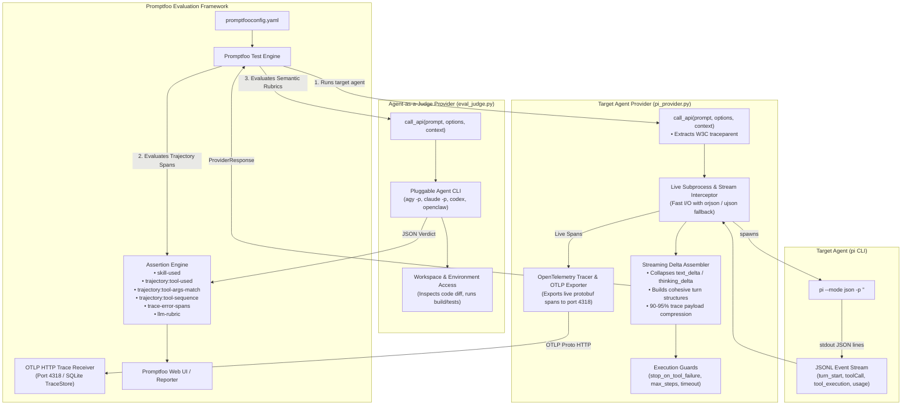
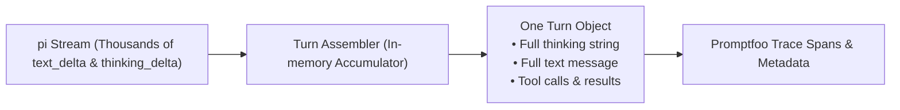

# Architecture & Design: Promptfoo Evaluation Harness for `pi` Agent

This document details the internal architecture, event streaming pipeline, trace normalization, and performance optimizations of the `pi` agent evaluation harness.

---

## 1. High-Level Architecture



---

## 2. Component Design & Contracts

### 2.1 Promptfoo Python Provider Interface

Promptfoo loads `file://pi_provider.py` and calls `call_api(prompt, options, context)`:

```python
def call_api(prompt: str, options: dict, context: dict) -> dict:
    """
    Args:
        prompt: Rendered test prompt.
        options: Provider configuration from promptfooconfig.yaml.
        context: Test variables (context['vars']), metadata, and test properties.

    Returns:
        ProviderResponse dictionary:
        {
            "output": str,             # Final assistant text message
            "error": Optional[str],    # Error message if execution crashed
            "tokenUsage": {
                "total": int,
                "prompt": int,
                "completion": int
            },
            "cost": float,             # USD cost reported by pi
            "metadata": {
                "skillCalls": List[dict],      # List of {"name": str, "path": str, "source": str} for skill-used
                "toolCalls": List[dict],       # Ordered list of all tool executions
                "turns": List[dict],           # Assembled reasoning + content per turn
                "trace": {                     # OTel-compliant spans for trajectory assertions
                    "spans": List[dict]
                },
                "stoppedEarly": bool,          # True if guard terminated execution
                "stopReason": Optional[str]    # Reason for early stop (e.g. 'tool_failure')
            }
        }
    """
```

---

## 3. Event Stream & Delta Assembly

### 3.1 `pi --mode json` Event Stream Model

`pi` outputs newline-delimited JSON (`ndjson`) with the following event types:

| Event `type` | Description | Relevant Fields |
| :--- | :--- | :--- |
| `session` | Session initialized | `id`, `cwd`, `timestamp` |
| `turn_start` | LLM turn initiated | `timestamp` |
| `message_update` | Incremental streaming chunks | `assistantMessageEvent.delta` (`text_delta`, `thinking_delta`, `toolcall_delta`), `usage` |
| `tool_execution_start` | Tool call started | `toolCallId`, `toolName`, `args` |
| `tool_execution_end` | Tool execution finished | `toolCallId`, `toolName`, `result`, `isError` |
| `turn_end` | Turn completed | `message`, `toolResults` |
| `agent_settled` | Agent completed execution | (stream termination marker) |

### 3.2 Streaming Delta Assembler (90–95% Payload Reduction)

Rather than storing thousands of granular delta events in memory, `pi_provider.py` runs an in-memory accumulator:



1. **Thinking Stream Aggregation:** Assembles `thinking_delta` chunks into a single `thinking` string per turn.
2. **Message Stream Aggregation:** Assembles `text_delta` chunks into a single `content` string per turn.
3. **Tool Argument Stream Aggregation:** Assembles `toolcall_delta` string fragments into parsed argument dicts.
4. **Milestone Retention:** Only completed turn and execution records are stored in `metadata.turns`.

---

## 4. OpenTelemetry OTLP Instrumentation & Trajectory Assertions

### 4.1 Live OTLP HTTP Protobuf Export Pipeline
To enable zero-code trajectory assertions in YAML, `pi_provider.py` integrates native OpenTelemetry instrumentation:

1. **W3C `traceparent` Propagation:** Extracts Promptfoo's active `context['traceparent']` so that all generated tool spans share the exact `trace_id` required for Promptfoo's SQLite `TraceStore`.
2. **Live Span Generation:** On each `tool_execution_start`, a child span is started with attributes:
   - `tool.name` & `gen_ai.tool.name`: Target tool name (`bash`, `read`, `edit`, `write`).
   - `tool.args`: Serialized arguments object.
   - `command` / `path` / `query`: Granular attributes for argument matching.
3. **Status & Error Recording:** On `tool_execution_end`, span status is set to `StatusCode.OK` or `StatusCode.ERROR` with `is_error` and duration metrics.
4. **Protobuf OTLP Export:** Spans are flushed via `OTLPSpanExporter` over HTTP to Promptfoo's embedded receiver at `http://localhost:4318/v1/traces`.

```json
{
  "trace": {
    "spans": [
      {
        "name": "bash",
        "attributes": {
          "tool.name": "bash",
          "command": "meson compile -C build",
          "tool.args": { "command": "meson compile -C build" },
          "tool.is_error": false,
          "gen_ai.turn.index": 0
        },
        "status": { "code": "OK" }
      },
      {
        "name": "read",
        "attributes": {
          "tool.name": "read",
          "path": "src/cloud_point/point_cloud_builder.cpp",
          "tool.args": { "path": "src/cloud_point/point_cloud_builder.cpp" },
          "tool.is_error": false,
          "gen_ai.turn.index": 1
        },
        "status": { "code": "OK" }
      }
    ]
  }
}
```

### 4.2 Skill Detection Rules & Schema
A skill invocation is recognized when:
1. `read` tool accesses `*/SKILL.md` (e.g. `.skills/<name>/SKILL.md` or `skills/<name>/SKILL.md`).
2. `bash` tool executes a script inside `*/.skills/<name>/*` or `*/skills/<name>/*`.

When detected:
- An entry is recorded in `metadata.skillCalls`:
  ```json
  [
    {
      "name": "pointcloud-ops",
      "path": ".skills/pointcloud-ops/SKILL.md",
      "source": "read"
    }
  ]
  ```
- The active OpenTelemetry child span is annotated with `skill.name = "<name>"`.
- Promptfoo's `skill-used` validator inspects `metadata.skillCalls` to match against `value: "<name>"`.

---

## 5. Agent-as-a-Judge Architecture (`eval_judge.py`)

For model-graded rubric assertions (`llm-rubric`), `eval_judge.py` serves as a universal, pluggable adapter that routes evaluation prompts to an autonomous agent CLI (`agy`, `claude`, `codex`, `openclaw`, `pi`) running in non-interactive mode.

### 5.1 Why Agent-as-a-Judge?
- **Environment Grounding:** Unlike isolated LLM APIs that only see text, an agent CLI evaluator possesses workspace and tool access (`read`, `bash`, `git diff`) and can actively verify file contents and test execution on disk.
- **Zero-Config Pluggability:** Swap the evaluator agent globally or per-test via `config.command` or `EVAL_JUDGE_COMMAND`.

---

## 6. Execution Interception & Early Stop Conditions

The provider supports runtime condition checks configured per test via `context.vars` or provider `options.config`:

1. **`stop_on_tool_failure` (bool):**  
   If `True`, the provider kills `pi` immediately when any `tool_execution_end` has `isError: true`. `metadata.stoppedEarly` is set to `True` and `metadata.stopReason` to `'tool_failure: <toolName>'`.

2. **`max_steps` (int):**  
   Terminates `pi` if total tool turns exceed the specified limit (prevents infinite loops and runaway costs).

3. **`timeout_seconds` (int, default: 120):**  
   Subprocess timeout protection.

4. **`cwd` (str):**  
   Working directory for the test execution (isolated test fixture or temporary worktree).

---

## 7. High-Performance Processing & Memory Safeguards

For large agent evaluations (e.g. 300+ LLM turns, 300+ tool invocations):

1. **`orjson` Fast Serialization Engine:** Uses `orjson` (compiled Rust) for JSON parsing and serialization (~5x faster than stdlib `json`), with automatic fallback to `ujson` or stdlib `json`.
2. **Tool Output Truncation Guard:** Tool output results (`t["result"]`) exceeding **32 KB** are truncated with a metadata indicator `[... truncated by pi_provider ...]` to protect Promptfoo's SQLite database from memory bloat while keeping full assertion accuracy.
3. **Zero-Config Virtualenv (`uv_python.sh`):** Executes on-demand dependencies (`opentelemetry-sdk`, `orjson`) via Astral's `uv` runner without requiring local virtualenv creation in target project directories.

---

## 8. Test-to-Test Workspace Isolation (`isolation.py`)

Modeled directly on Chromium's [`agents/testing/workers.py`](https://chromium.googlesource.com/chromium/src/+/refs/heads/main/agents/testing/workers.py) (`WorkDir` & `checkout_helpers.py`), `isolation.py` allows tests to perform destructive mutations (file deletion, editing, build rebuilds) without dirtying the source repository.

### 8.1 Isolation Strategies

| Strategy | Implementation | Overhead | Use Case |
| :--- | :--- | :--- | :--- |
| **`git-worktree`** | `git worktree add --detach <path> HEAD` | <50ms | Code edits, refactoring, test additions. |
| **`copy` / `reflink`** | `cp -a --reflink=auto <src>/. <dest>` | <200ms | Tasks modifying untracked build folders (`build/`). |
| **`in-place`** | `git stash` $\to$ test $\to$ `git reset --hard && git clean -fd` | <100ms | In-place testing where path identity must be preserved. |
| **`btrfs`** | `btrfs subvolume snapshot <src> <dest>` | <10ms | Linux hosts with Btrfs partitions. |

### 8.2 Teardown & Lifecycle
`WorkspaceIsolation` implements Python's context manager interface (`AbstractContextManager`). When `clean=True` (default), the temporary workdir is cleanly removed via `git worktree remove --force` or `shutil.rmtree` on test exit, guaranteeing zero state leakage between test iterations.
